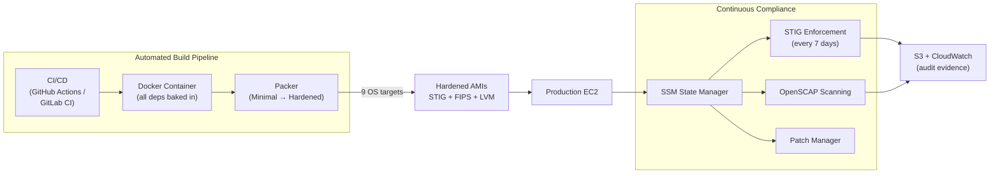

# Chimera Platform — Capability Summary

Chimera is a reusable, fully automated platform for building DISA STIG-hardened Amazon Machine Images. It produces compliance-ready AMIs for 9 operating systems across connected and air-gapped AWS environments, with continuous post-deployment enforcement via AWS Systems Manager. The entire pipeline — from infrastructure provisioning through STIG hardening to compliance evidence generation — runs unattended through CI/CD.

## Architecture at a Glance

> To export this diagram as PNG for email or PDF: paste the Mermaid source into [mermaid.live](https://mermaid.live), then click the PNG download button.

## Platform Support

| Linux | Windows |
|-------|---------|
| RHEL 9, RHEL 8, Oracle Linux 9, Oracle Linux 8, Rocky Linux 9, Alma Linux 9, Amazon Linux 2023 | Windows Server 2019, Windows Server 2022 |

## Key Value

| Metric | Without Chimera | With Chimera | Reduction |
|--------|----------------|--------------|-----------|
| First hardened AMI (1 OS) | 80–120 engineer-hours | 4–6 hours | **~95%** |
| Full platform (9 OS) | 720–1,080 hours | 36–54 hours | **~95%** |
| Monthly compliance verification | 72–144 hours/month | 0 (automated) | **100%** |
| New team onboarding | 2–4 weeks | 2–3 days | **~85%** |
| ATO evidence collection | 180–360 hours | 8–16 hours | **~95%** |

**Estimated annual savings: 1,500–3,000+ engineer-hours per program.**

## Air-Gapped Delivery

The entire platform operates in disconnected environments. A self-contained Docker image (~305 MB) carries all dependencies — Packer, Ansible, AWS CLI, STIG roles, and AMIgen scripts. Transfer the tarball to an air-gapped GitLab runner via SCP, USB, or secure file share. No internet access is required at build time. VPC endpoints provide private connectivity for all AWS API calls.

## What's Included

The Chimera Platform capability package provides:

- **Reference Architecture** — Mermaid diagrams, component map, security boundaries, platform support matrix
- **Operating Model** — Day 0/1/2+ lifecycle phases, RACI matrix, automated schedules
- **Onboarding Guide** — Zero-to-first-AMI walkthrough for connected and air-gapped environments
- **Runbook** — 8 operational procedures (monthly refresh, new STIG benchmarks, KMS rotation, etc.)
- **Troubleshooting Guide** — Decision-tree diagnosis for build, infrastructure, SSM, and air-gapped failures
- **Template Package** — Configuration reference, infrastructure customization, and pre-flight checklists for new programs
- **Value Brief** — Quantified ROI with industry benchmarks and proposal talking points
- **Infrastructure as Code** — OpenTofu modules for VPC, IAM, and SSM (STIG enforcement, patching, scanning, auto-tagging)

## Getting Started

1. Clone the repository
2. Follow the [Onboarding Guide](onboarding-guide.md)
3. First hardened AMI in 4–6 hours

## Contact

| | |
|---|---|
| **Team** | *[Your team name]* |
| **Slack** | *[#your-channel]* |
| **Repository** | *[repo URL]* |
