# Operating Model

> **Crucible Platform** — Day 0 through steady-state operations for STIG-hardened AMI builds and continuous compliance.

This document defines responsibilities, schedules, and workflows for each phase of the platform lifecycle.

## Lifecycle Phases

```mermaid
gantt
    title Platform Lifecycle
    dateFormat X
    axisFormat %s

    section Day 0 — Setup
    IAM + CI/CD configuration  :d0a, 0, 1

    section Day 1 — Build
    First Docker image build   :d1a, 1, 2
    Infra provisioned (auto)   :d1b, 2, 3
    First hardened AMI         :d1c, 3, 6
    Validate + distribute      :d1d, 6, 7

    section Day 2+ — Operate
    Scheduled STIG enforcement :d2a, 7, 30
    Patch management           :d2b, 7, 30
    Monthly AMI refresh        :d2c, 7, 30
```

## Day 0 — Setup

**Duration**: 30–60 minutes

Day 0 is the one-time manual work needed before CI/CD can take over. Infrastructure provisioning is **not** part of Day 0 — the build pipelines handle it automatically (see Day 1).

### Steps

1. **Configure IAM prerequisites** (one-time per AWS account) — Create an IAM OIDC identity provider for GitHub Actions or GitLab, and an IAM role with permissions for Packer, OpenTofu, and SSM. Set `MaxSessionDuration` to at least 21600 (6 hours). See [CI-CD-Setup — IAM Configuration](../CI-CD-Setup.md#aws-iam-configuration) for the full IAM policies.

2. **Configure CI/CD** — Store the IAM role ARN as a CI/CD secret (`AWS_ROLE_ARN` in GitHub, `CI_AWS_ROLE_ARN` in GitLab) and set any environment-specific variables (region, air-gap toggles). See the [Onboarding Guide](onboarding-guide.md) for the full walkthrough.

### Day 0 Outputs

| Output | Used By |
|--------|---------|
| IAM OIDC provider | CI/CD credential exchange |
| IAM role ARN | CI/CD secrets / variables |

## Day 1 — Build

**Duration**: 2–5 hours per OS (see [Build Times](../../README.md#build-times))

### Steps

1. **Build Docker image** (if not already available) — Run the `offline-prepare.yml` workflow. Produces `crucible-builder-YYYYMMDD.tar.gz` (~378 MB). For air-gapped environments, transfer the tarball to the GitLab runner.

2. **Run AMI builds** — Trigger the build pipeline with desired OS targets. The pipeline automatically provisions infrastructure on the first run:
   - **GitHub Actions**: `build.yml` calls `infra-setup.yml` (`action=apply`, idempotent) before building — backend bootstrap, tfvars generation, and `tofu apply` all happen automatically.
   - **GitLab CI**: Run `infra:create` as part of the pipeline flow (idempotent; no-op if infrastructure exists).

   Infrastructure created on first run includes:
   - VPC, subnet, security group, optional internet gateway
   - VPC endpoints (8 types for air-gapped SSM connectivity)
   - IAM roles and instance profiles for Packer-launched EC2 instances
   - KMS CMK for encrypting S3, CloudWatch, SSM, and SNS
   - S3 buckets for SSM output and compliance evidence
   - CloudWatch log group (90-day retention)
   - SSM documents (OpenSCAP scan, Windows STIG enforce, Session Manager preferences)
   - State Manager associations (STIG enforcement, scanning, inventory, patching)
   - Patch Manager baselines and maintenance windows
   - DHMC (auto-registers all EC2 instances with SSM)
   - Auto-tagging (EventBridge + Lambda propagates AMI tags to instances)

   The build itself then:
   - Builds minimal AMIs (EBS surrogate: custom LVM partitioning, OS install, AWS tooling)
   - Builds hardened AMIs (launches from minimal, applies STIG lockdown via Ansible/AWS scripts)
   - Runs compliance scans (OpenSCAP + Goss) and downloads reports as artifacts
   - Deregisters intermediate minimal AMIs after successful hardened builds

3. **Validate** — Launch an instance from the hardened AMI and run `tests/test-ssm-validation.sh` to verify SSM registration, RunCommand, and Session Manager connectivity.

4. **Distribute** — Copy AMIs to additional regions if needed (`aws_ami_regions` variable). Update launch templates or Auto Scaling groups to reference the new AMI.

### Day 1 Outputs

| Output | Location |
|--------|----------|
| AWS infrastructure (VPC, IAM, SSM) | OpenTofu state (persisted in S3) |
| Hardened AMI IDs | AWS EC2 (logged in CI/CD job summary) |
| OpenSCAP HTML report | CI/CD build artifact |
| Goss JSON delta | CI/CD build artifact |

## Day 2+ — Operate

Once hardened AMIs are in production, the SSM infrastructure handles continuous compliance automatically.

### Automated Schedules

| Activity | Schedule | Mechanism | Target |
|----------|----------|-----------|--------|
| STIG enforcement (Linux) | Every 7 days | SSM State Manager | `StigPlatform=EL8\|EL9\|AL2023` |
| STIG enforcement (Windows) | Every 7 days | SSM State Manager | `StigPlatform=Win2019\|Win2022` |
| OpenSCAP compliance scan | Every 7 days | SSM State Manager | `StigPlatform=EL*` |
| Ansible STIG check (read-only) | Every 7 days | SSM State Manager | `StigPlatform=EL*` |
| Software inventory collection | Every 12 hours | SSM State Manager | `StigManaged=true` |
| SSM Agent auto-update | Daily (3:00 AM UTC) | SSM State Manager | All instances |
| Patch scan + install | Sunday 4:00 AM UTC | Patch Manager maintenance window | Patch group members |

### Monthly AMI Refresh

Rebuild AMIs monthly (or when new STIG benchmarks or OS patches are released):

1. Increment `CRUCIBLE_VERSION` (e.g., `2026.04.1`)
2. Trigger the build pipeline
3. Validate new AMIs (compliance scan + SSM connectivity)
4. Update launch templates / ASGs to reference new AMI IDs
5. Rotate out old instances on next deployment cycle

See [Runbook — Monthly AMI Refresh](runbook.md#procedure-1-monthly-ami-refresh) for the full procedure.

### Compliance Evidence Collection

Evidence is generated automatically and stored for audit:

| Evidence Type | Format | Storage | Retention |
|---------------|--------|---------|-----------|
| OpenSCAP scan reports | HTML + XML | S3 `ssm-output/` prefix | S3 lifecycle policy |
| Ansible check-mode output | JSON | S3 `ssm-output/` prefix | S3 lifecycle policy |
| Goss pre/post delta | JSON | CI/CD build artifacts | 30 days (configurable) |
| SSM RunCommand logs | Text | CloudWatch log group | 90 days (configurable) |
| Session Manager recordings | Binary | S3 (KMS-encrypted) | S3 lifecycle policy |
| Patch compliance | SSM Compliance | AWS SSM console | Indefinite |

## Roles and Responsibilities

### RACI Matrix

| Activity | Platform Engineer | Security Engineer | Program ISSO |
|----------|:-:|:-:|:-:|
| Day 0 infrastructure provisioning | **R/A** | C | I |
| Docker image builds | **R/A** | I | I |
| AMI builds (monthly refresh) | **R/A** | C | I |
| STIG exception documentation | C | **R/A** | **A** |
| OpenSCAP scan review | I | **R/A** | I |
| Patch Manager configuration | **R/A** | C | I |
| Patch compliance monitoring | C | **R/A** | I |
| SSM association failure triage | **R/A** | C | I |
| New STIG benchmark integration | C | **R/A** | I |
| ATO evidence package assembly | C | **R** | **A** |
| KMS key rotation | **R/A** | C | I |
| New account/region onboarding | **R/A** | C | I |

**R** = Responsible, **A** = Accountable, **C** = Consulted, **I** = Informed

### Role Definitions

**Platform Engineer** — Owns the build pipeline, infrastructure, and AMI lifecycle. Responsible for monthly refreshes, infrastructure changes, and troubleshooting build failures.

**Security Engineer** — Owns STIG compliance posture. Reviews scan results, documents exceptions, integrates new benchmarks, and assembles ATO evidence from automated outputs.

**Program ISSO** — Accountable for ATO package completeness. Reviews exceptions, approves compensating controls, signs off on compliance evidence.

## Steady-State Monitoring

### What to Watch

| Signal | Where to Check | Action on Failure |
|--------|---------------|-------------------|
| SSM association execution | AWS SSM Console → State Manager | Check instance tags, verify AMI has required tools pre-installed |
| OpenSCAP scan score regression | S3 `ssm-output/` → HTML reports | Investigate new findings; check if upstream role changed |
| Patch compliance drift | SSM Console → Compliance | Verify maintenance window ran; check patch group membership |
| SSM Agent connectivity | SSM Console → Fleet Manager | Check VPC endpoints, instance profile, security group rules |
| CI/CD build failures | GitHub Actions / GitLab CI logs | See [Troubleshooting Guide](troubleshooting-guide.md) |
| Iron Bank token expiry | `ironbank-token-check.yml` (monthly) | Regenerate at registry1.dso.mil → User Profile → CLI Token |

### Alerting

The SSM module optionally provisions an SNS topic for alerts. Subscribe an email address or PagerDuty endpoint to receive notifications for:

- CloudWatch metric alarm triggers (e.g., failed SSM commands)
- Patch Manager compliance changes
- SSM document execution failures

Configure via `notification_email` variable in `infra/modules/ssm/variables.tf`.

## Scaling to Multiple Programs

When deploying Crucible across multiple programs or AWS accounts:

1. **One SSM infrastructure per account** — SSM resources (DHMC, associations, patch baselines) are account-wide. The first build in each account provisions infrastructure automatically via the pipeline.
2. **Ephemeral networking per build** — VPCs and subnets are created and destroyed per build cycle (or kept persistent if preferred). Cost is minimal.
3. **Shared Docker image** — The same `crucible-builder` Docker image works across all accounts and programs. Build once, distribute to each environment.
4. **Per-program STIG customization** — Override Ansible variables via `crucible/ansible/` role defaults or add program-specific exception documentation.

See [Template Package](template-package.md) for the full adaptation guide.
