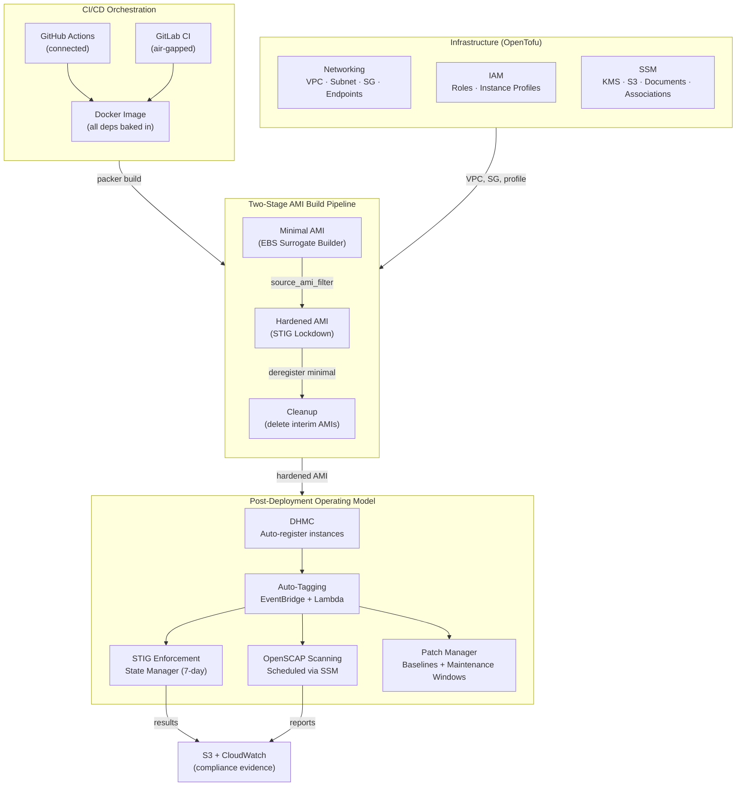
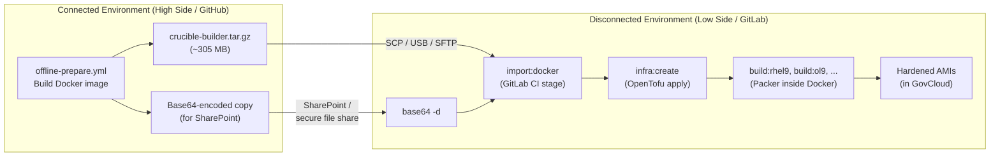
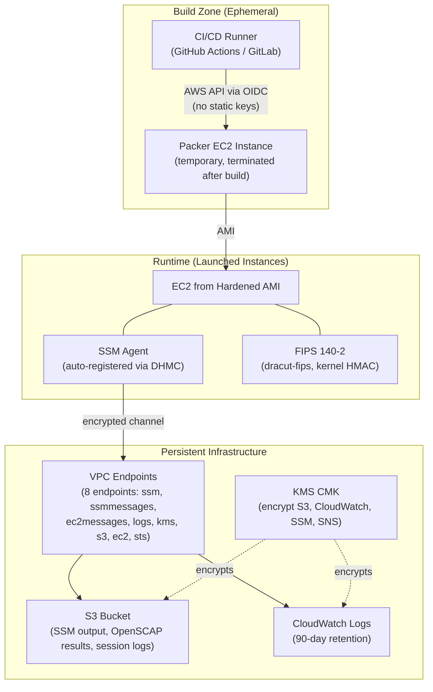
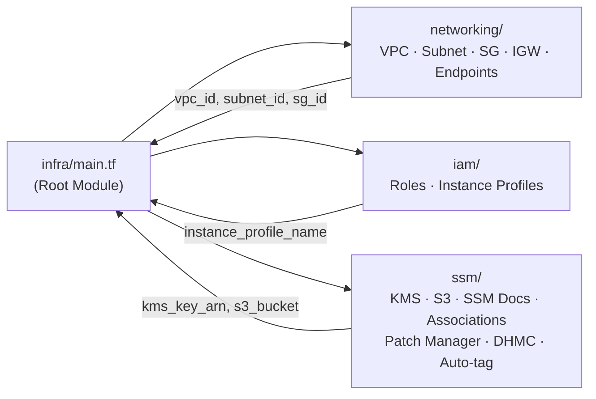

# Reference Architecture

> **Crucible Platform** — Automated STIG-hardened AMI builds with air-gapped delivery and continuous compliance.

This document describes the end-to-end architecture for building, delivering, and operating DISA STIG-compliant Amazon Machine Images across connected and disconnected AWS environments.

## Architecture Overview

## Component Map

| Component | Role | Key Files |
|-----------|------|-----------|
| **Packer** (1.11.2) | Orchestrates EC2 instance launch, provisioning, and AMI creation | `crucible/minimal.pkr.hcl`, `crucible/hardened.pkr.hcl` |
| **AMIgen Scripts** | Chroot-based disk partitioning, OS install, AWS tooling for minimal AMIs | `vendor/amigen9/DiskSetup.sh`, `OSpackages.sh`, `AWSutils.sh` |
| **Ansible Lockdown** | STIG hardening for RHEL 8/9 and clones via upstream roles | `crucible/ansible/`, `requirements.yml` |
| **AWS STIG Script** | AL2023 hardening (no DISA benchmark exists; uses RHEL 9 STIG baseline) | `crucible/ansible/roles/AL2023-STIG/` |
| **OpenTofu** | Provisions VPC, IAM, and SSM infrastructure as code | `infra/main.tf`, `infra/modules/{networking,iam,ssm}` |
| **Docker** | Packages all build dependencies into a portable, air-gap-ready container | `Dockerfile` |
| **SSM State Manager** | Post-deployment STIG enforcement, compliance scanning, patching | `infra/modules/ssm/ssm-stig-enforcement.tf`, `ssm-associations.tf` |
| **OpenSCAP** | DISA STIG profile scanning; produces HTML + XML compliance evidence | Built into hardened AMIs via `scap-security-guide` |
| **Goss** | Lightweight before/after compliance delta reports (JSON) | Invoked by Ansible Lockdown roles |
| **build.sh** | Top-level orchestrator: minimal → hardened → cleanup | `build.sh` |
| **GitHub Actions** | Connected CI/CD: Docker build, infra provisioning, Packer execution | `.github/workflows/{offline-prepare,infra-setup,build}.yml` |
| **GitLab CI** | Air-gapped CI/CD: Docker import, infra provisioning, offline builds | `.gitlab-ci.yml`, `.gitlab/infra.gitlab-ci.yml` |

## Air-Gapped Delivery Model

The pipeline supports a complete low-to-high transfer workflow for disconnected environments:

### Offline Build Configuration

When building in disconnected environments, a single `AIRGAP_MODE` toggle sets four flags:

| Flag | Effect |
|------|--------|
| `cross_distro=true` | Skip RHUI auto-detection (no internet to verify) |
| `use_default_repos=false` | Disable default RHUI repos |
| `repo_nosignature=true` | Accept unsigned RPMs from local mirrors |
| `sslverify_disable=true` | Allow self-signed certificates on internal mirrors |

Additional air-gapped configuration:

- **Local YUM mirror**: Set `REPO_MIRROR_BASEURL` (e.g., `http://mirror.internal.mil`)
- **Package sources**: Use `file:///tmp/offline-packages/*` prefix for AWS CLI, CFN Bootstrap, SSM Agent
- **VPC endpoints**: EC2 + STS endpoints for Packer API calls; SSM + S3 + KMS + CloudWatch endpoints for operational model
- **Docker image**: Pre-staged at `/transfer/crucible-builder-*.tar.gz` on the GitLab runner

## Security Boundaries

### Encryption

| Layer | Mechanism | Configuration |
|-------|-----------|---------------|
| **EBS volumes** | AWS-managed or CMK encryption | `aws_kms_key_id` variable in Packer / OpenTofu |
| **S3 (compliance evidence)** | SSE-KMS with CMK | `infra/modules/ssm/s3.tf` |
| **CloudWatch Logs** | KMS encryption | `infra/modules/ssm/cloudwatch.tf` |
| **SSM sessions** | KMS encryption + S3 logging | `infra/modules/ssm/ssm-documents.tf` (Session Manager prefs) |
| **In transit** | VPC endpoints (private link, no internet traversal) | `infra/modules/ssm/vpc-endpoints.tf` |
| **FIPS 140-2** | `dracut-fips` + kernel HMAC validation | `crucible/scripts/boot-fips-wrapper.sh` |

### Authentication

| Actor | Method |
|-------|--------|
| GitHub Actions → AWS | OIDC federation (short-lived tokens, no static keys) |
| GitLab CI → AWS | OIDC federation (GitLab 15.7+) or static keys |
| EC2 instances → SSM | Instance profile + DHMC auto-registration |
| Session Manager users | IAM + KMS + S3 audit logging with 20-min idle timeout (STIG AC-12 / SC-10) |

## Post-Deployment Operating Model

Once hardened AMIs are launched, the SSM infrastructure provides continuous compliance:

### Tagging Strategy

AMI tags propagate to instances via EventBridge + Lambda (`infra/modules/ssm/auto-tagging.tf`):

| Tag | Values | Purpose |
|-----|--------|---------|
| `StigPlatform` | `EL8`, `EL9`, `AL2023`, `Win2019`, `Win2022` | Target SSM associations by OS |
| `StigManaged` | `true` | Mark all hardened instances for SSM targeting |

### SSM Associations

| Association | Target | Schedule | Action |
|-------------|--------|----------|--------|
| STIG Enforcement (EL8/EL9) | `StigPlatform=EL8\|EL9` | `rate(7 days)` | Run Ansible Lockdown in enforce mode |
| STIG Enforcement (AL2023) | `StigPlatform=AL2023` | `rate(7 days)` | Run native STIG enforcement script |
| STIG Enforcement (Windows) | `StigPlatform=Win2019\|Win2022` | `rate(7 days)` | AWSEC2-ConfigureSTIG + admin rename restore |
| OpenSCAP Scan | `StigPlatform=EL*` | `rate(7 days)` | DISA STIG profile scan → S3 |
| Ansible STIG Check | `StigPlatform=EL*` | `rate(7 days)` | Ansible `--check` mode (read-only audit) |
| Software Inventory | All `StigManaged=true` | `rate(12 hours)` | Gather installed packages and services |
| SSM Agent Update | All instances | `rate(1 day)` | Auto-update SSM Agent |

### Patch Manager

| Setting | Value |
|---------|-------|
| Baselines | Security + Bugfix (Critical/Important/Moderate) |
| Patch groups | Linux, Windows (separate baselines) |
| Maintenance window | Sunday 4:00 AM UTC, 3-hour duration |
| Auto-approval delay | 7 days (configurable) |
| Auto-reboot | Enabled |

### Compliance Evidence Flow

All SSM outputs route to S3 and CloudWatch for audit:

- **OpenSCAP HTML/XML reports** → `s3://<bucket>/ssm-output/`
- **Ansible check-mode deltas** → `s3://<bucket>/ssm-output/`
- **Goss JSON reports** → downloaded as CI/CD build artifacts
- **RunCommand logs** → CloudWatch log group (90-day retention, KMS-encrypted)
- **Session recordings** → S3 (KMS-encrypted)

## Platform Support Matrix

| OS | Builder Type | STIG Source | Hardening Method | FIPS |
|----|-------------|-------------|------------------|------|
| RHEL 9 | `amazon-ebssurrogate` | DISA RHEL 9 STIG | Ansible Lockdown (RHEL9-STIG) | Yes |
| RHEL 8 | `amazon-ebssurrogate` | DISA RHEL 8 STIG | Ansible Lockdown (RHEL8-STIG) | Yes |
| Oracle Linux 9 | `amazon-ebssurrogate` | DISA RHEL 9 STIG | Ansible Lockdown (RHEL9-STIG) | Yes |
| Oracle Linux 8 | `amazon-ebssurrogate` | DISA RHEL 8 STIG | Ansible Lockdown (RHEL8-STIG) | Yes |
| Rocky Linux 9 | `amazon-ebssurrogate` | DISA RHEL 9 STIG | Ansible Lockdown (RHEL9-STIG) | Yes |
| Alma Linux 9 | `amazon-ebssurrogate` | DISA RHEL 9 STIG | Ansible Lockdown (RHEL9-STIG) | Yes |
| Amazon Linux 2023 | `amazon-ebssurrogate` | RHEL 9 STIG (adapted) | AL2023-STIG role + AWS script | Yes |
| Windows Server 2019 | `amazon-ebs` | DISA Windows 2019 STIG | AWSEC2-ConfigureSTIG + wrapper | N/A |
| Windows Server 2022 | `amazon-ebs` | DISA Windows 2022 STIG | AWSEC2-ConfigureSTIG + wrapper | N/A |

Each Linux build produces two AMIs (minimal + hardened). Windows builds produce one hardened AMI. See [STIG Exceptions](../STIG_EXCEPTIONS.md) for controls intentionally skipped and compensating controls.

## Infrastructure Modules

The OpenTofu root module (`infra/main.tf`) wires three independent submodules:

### Feature Toggles

Every major component can be independently disabled:

| Toggle | Default | Effect |
|--------|---------|--------|
| `enable_internet_gateway` | `true` | Disable for air-gapped (requires VPC endpoints) |
| `enable_packer_endpoints` | `false` | EC2 + STS endpoints for air-gapped Packer API calls |
| `enable_vpc_endpoints` | `true` | SSM, S3, KMS, CloudWatch endpoints |
| `enable_patch_manager` | `true` | Patch baselines + maintenance windows |
| `enable_session_manager` | `true` | Session Manager + encrypted logging |
| `enable_auto_tagging` | `true` | EventBridge + Lambda for AMI→instance tag propagation |

See [infra/README.md](../../infra/README.md) for input/output reference.
